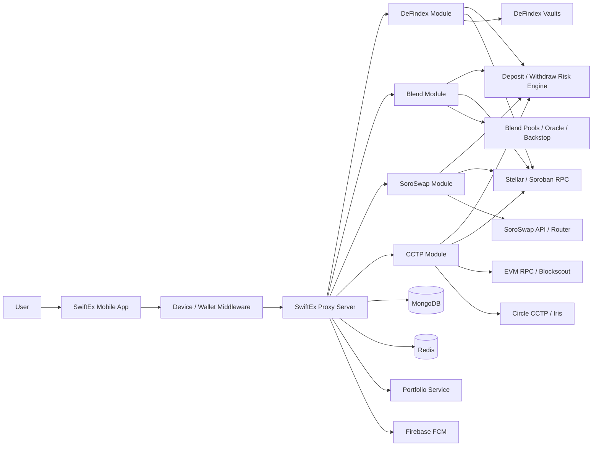
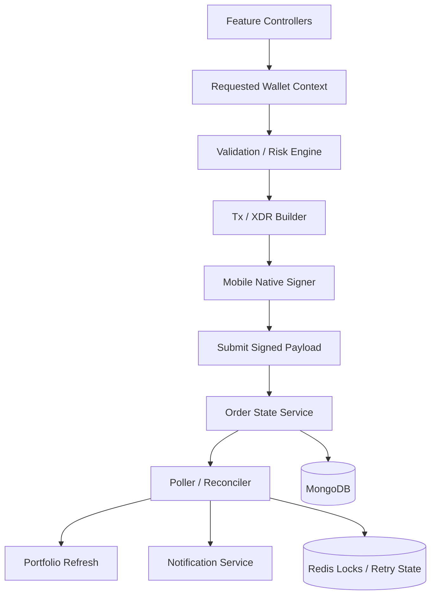
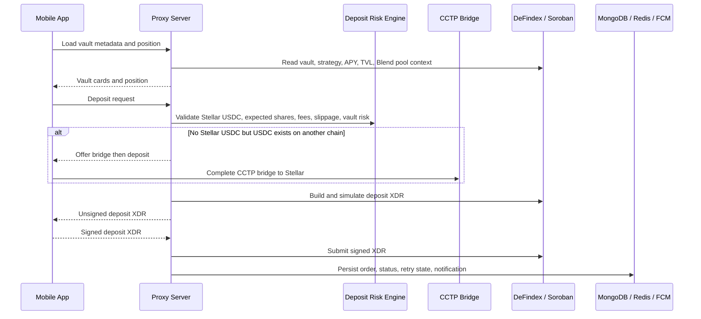
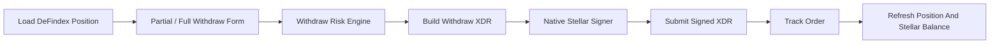
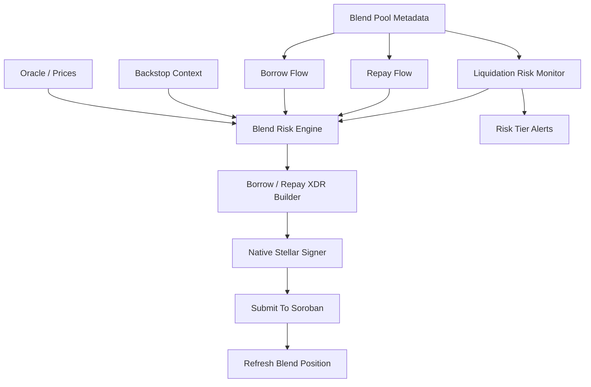
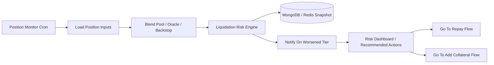
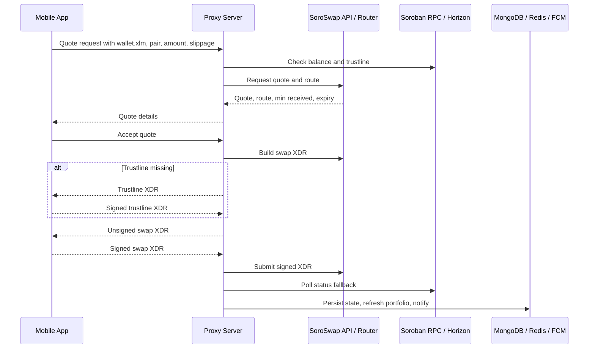
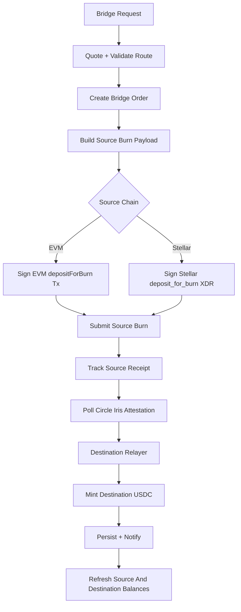
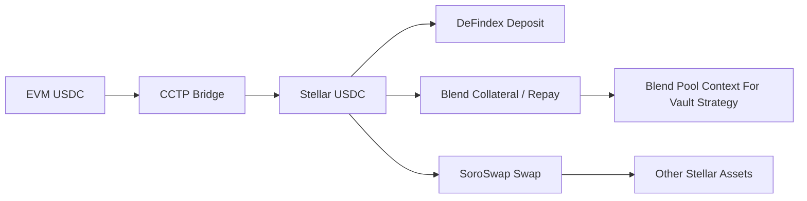

# DeFi And Bridge Integration Architecture

This document describes the planned SwiftEx integration architecture for DeFindex, Blend, SoroSwap, and CCTP.

Detailed flow diagrams live in [swiftex-diagaram.drawio](./swiftex-diagaram.drawio):

- `DeFindex Flow`
- `DeFindex Withdraw Flow`
- `Blend Borrow Flow`
- `Blend Repay Flow`
- `Blend Liquidation Risk Monitoring`
- `SoroSwap Flow`
- `CCTP Bridge Flow`

## Architecture Goal

SwiftEx should expose DeFi and bridge workflows through the mobile app while keeping provider API keys, validation, order tracking, polling, retries, portfolio refresh, and notifications in the proxy server.

The app remains the signing boundary. The backend builds unsigned EVM transactions or Stellar/Soroban XDR payloads, validates request context, submits signed payloads, tracks status, and refreshes portfolio state.

## High Level Integration Diagram

## Integration Responsibilities

| Integration | Primary purpose | Backend owns | App owns | External systems |
|---|---|---|---|---|
| DeFindex | Vault deposit and withdraw | Vault metadata, risk checks, XDR build, order tracking, position refresh | Vault selection, amount input, signing deposit/withdraw XDR | DeFindex, Blend pool context, Soroban RPC |
| Blend | Borrow, repay, liquidation risk monitoring | Pool metadata, borrow/repay risk, XDR build, position snapshots, alerting | Collateral/borrow/repay input, signing XDR, action selection | Blend pool contracts, oracle, backstop, Soroban RPC |
| SoroSwap | Stellar-only swaps | Quote, route validation, trustline detection, XDR build, submit, polling | Pair/amount/slippage input, trustline signature, swap signature | SoroSwap API, router, AMM liquidity, Soroban RPC/Horizon |
| CCTP | Native USDC bridge between EVM and Stellar | Route validation, source burn payload, source tx tracking, Iris polling, destination relay | Source/destination selection, EVM tx signing or Stellar XDR signing | Circle CCTP contracts, Iris API, EVM RPC, Blockscout, Soroban RPC |

## Shared Backend Components

Shared rules:

- Device auth or wallet auth must attach the requested wallet context before feature handlers run.
- For Stellar flows, `wallet.xlm` is the signing and account context.
- For EVM bridge flows, `wallet.multi` is used for EVM signing and ownership checks.
- The backend never receives private keys.
- The backend stores only order state, signed transaction payloads or hashes where required, retry state, provider metadata, and portfolio snapshots.
- Portfolio refresh should run after confirmed deposit, withdraw, borrow, repay, swap, and bridge completion.
- Notifications should be driven by persisted order state changes, not transient provider responses alone.

## DeFindex Architecture

DeFindex is a Stellar/Soroban vault flow. It depends on vault metadata, strategy metadata, Blend pool context, backstop context, risk checks, and Stellar account balances.

### Deposit Flow

Deposit behavior:

- If the user has Stellar USDC, show direct deposit.
- If the user has USDC only on another chain, show bridge then deposit through CCTP.
- The user should see the target vault strategy, Blend pool, APY, backstop context, estimated shares, and risk before signing.
- Deposit execution is Stellar-only once funds are on Stellar.

### Withdraw Flow

Withdrawals return funds to the user's Stellar wallet only. The user can later bridge or withdraw elsewhere themselves.

Withdraw behavior:

- Partial withdraw must be supported.
- Full withdraw is just a max amount action, not a separate architecture.
- Risk checks should include withdrawable amount, vault liquidity, expected USDC, fees, slippage, and post-withdraw position.

## Blend Architecture

Blend integration covers borrow, repay, and liquidation risk monitoring.

### Borrow

Borrow flow:

1. Load pool metadata, collateral assets, borrow assets, wallet balances, rates, rewards, and current position.
2. Show collateral factor, borrow limit, borrow APY, health, liquidation threshold, and backstop context.
3. Validate collateral amount, borrow amount, pool liquidity, health factor, price impact, and liquidation risk.
4. Build unsigned Soroban XDR for supply collateral and borrow.
5. App signs XDR.
6. Backend submits, tracks, refreshes position, and sends status notification.

### Repay

Repay flow:

1. Load current liability, accrued interest, collateral, health, balances, and rewards.
2. Allow partial repay or full repay.
3. Validate repay amount, wallet balance, interest, and post-repay health.
4. Build unsigned repay XDR.
5. App signs XDR.
6. Backend submits, tracks, refreshes position, and sends status notification.

Repay does not automatically withdraw collateral. Collateral withdrawal should be a separate signed user action.

### Liquidation Risk Monitoring

The monitor is alerting-only. It should not automatically repay, withdraw, add collateral, or execute liquidation.

Risk tiers should be persisted so alerts can be deduped and only sent when the risk tier worsens.

## SoroSwap Architecture

SoroSwap is a Stellar-only swap flow. The backend keeps the SoroSwap API key server-side.

SoroSwap behavior:

- Validate `wallet.xlm`, supported assets, source balance, destination trustline, slippage, route expiry, and quote freshness.
- Show expected output, min received, price impact, route split, provider/liquidity sources, and expiry.
- Build trustline XDR only when needed.
- Treat quote, build, submit, and status responses as untrusted provider data until validated.

## CCTP Architecture

CCTP bridges native USDC between EVM and Stellar without a liquidity pool. It supports both directions:

- EVM to Stellar
- Stellar to EVM

CCTP behavior:

- Validate supported source/destination domains, native USDC asset, wallet context, balances, allowance, amount bounds, and destination address format.
- For EVM source, build approve when needed and depositForBurn transaction payload.
- For Stellar source, build deposit_for_burn XDR.
- Poll source receipt through EVM RPC, Blockscout, Soroban RPC, or Horizon as appropriate.
- Poll Circle Iris until attestation is ready.
- Relay destination mint through receiveMessage or Stellar receive_message plus forwarder.
- Persist every durable state transition: source submitted, source confirmed, attested, destination submitted, completed, failed, or retryable.

## Cross Integration Flows

Important cross-flow rules:

- DeFindex deposit can depend on CCTP when the user has USDC outside Stellar.
- DeFindex withdraw returns to Stellar only.
- Blend borrow/repay and DeFindex deposit/withdraw are separate signed Soroban actions.
- SoroSwap can rebalance Stellar assets but should not be hidden inside DeFindex or Blend actions unless explicitly added later.
- Blend pool APY, backstop, and liquidation context should be visible wherever a DeFindex vault strategy deposits into Blend.

## Data And State

| State | Storage | Notes |
|---|---|---|
| Integration order | MongoDB | One durable record per deposit, withdraw, borrow, repay, swap, or bridge. |
| Retry and lock state | Redis | Prevent duplicate pollers/submits and support bounded retry. |
| Quote cache | Redis or MongoDB | Keep short-lived quote/build context for SoroSwap and CCTP where needed. |
| Position snapshot | MongoDB | DeFindex and Blend position views, liquidation risk snapshots. |
| Portfolio snapshot | MongoDB | Refreshed after confirmed state transitions. |
| Notification target | Device/FCM records | Notify only after persisted status changes. |

## Security Boundaries

- The mobile app signs transactions; the backend must not hold private keys.
- `wallet.xlm` is required for Stellar/Soroban DeFi and SoroSwap flows.
- `wallet.multi` is required for EVM-side CCTP flows.
- DTO wallet addresses are accepted only for backward compatibility where required; backend logic should prefer requested wallet context from auth middleware.
- Provider API keys stay server-side.
- Provider responses must be validated before changing order state or portfolio state.
- Unsigned transaction and XDR payloads must be generated from validated server-side inputs, not copied from client input.
- Signed payloads should be submitted only for the authenticated requested wallet context.

## Operational Behavior

- Pollers should be idempotent by order ID or tx hash.
- Every poller must have bounded retry and an exhausted or retryable state.
- Redis locks should prevent duplicate submission and duplicate notification.
- Portfolio refresh should be decoupled from provider webhooks and run after confirmed execution.
- Notifications should be state-driven and deduped.
- Logs must avoid secrets, raw auth tokens, API keys, full signed payloads, and overly large provider responses.

## Implementation Shape

Planned backend modules should stay focused:

- `defindex`: vault metadata, deposit build/submit/status, withdraw build/submit/status, position refresh.
- `blend`: pool metadata, borrow build/submit/status, repay build/submit/status, liquidation risk snapshots and alerts.
- `soroswap`: quote, route, trustline check/build, swap XDR build, submit, status polling.
- `cctp`: quote/route validation, source burn build, source tx tracking, Iris attestation polling, destination relay, bridge status.

Shared services should be reused where possible:

- wallet context middleware
- portfolio refresh service
- notification service
- Redis locking/retry helpers
- MongoDB order repositories
- Soroban RPC/Horizon client helpers
- EVM RPC/Blockscout receipt helpers

