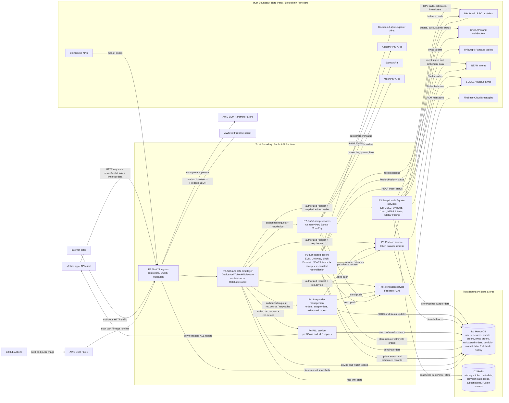

# Level-1 Data Flow Diagram

## Diagram

## Data Flows

| ID | Flow | Data | Trust boundary crossed | Notes |
|---|---|---|---|---|
| F1 | Client to API | Device token, wallet token, wallet address, token identifiers, signed txs, quote/order DTOs | TB1 | Primary public API boundary. |
| F2 | API auth layer to MongoDB | Device lookup and wallet ownership lookup | TB2/TB3 | Middleware verifies JWTs and attaches `req.device` / `req.wallet`. |
| F3 | API auth layer to Redis | Rate-limit counters keyed by request IP/device/wallet | TB4 | Redis availability affects request acceptance. |
| F4 | Swap services to blockchain RPC | `eth_call`, gas estimate, nonce, balance, receipt, signed transaction broadcast | TB5 | Signed transactions can move funds once broadcast. |
| F5 | Swap services to 1inch | API key, quote/build/order/secret/status requests, WebSocket events | TB6 | Fusion/Fusion+ settlement depends on provider responses and secret handling. |
| F6 | Swap services to Uniswap/Pancake tooling | Quote/swap transaction data and token metadata | TB6 | Used for EVM swap preparation/execution. |
| F7 | Swap services to NEAR Intents | Intent/deposit/status data | TB6 | NEAR Intent poller reconciles pending/exhausted orders. |
| F8 | Swap services to Stellar trading | Stellar wallet/trade data for SDEX/Aquarius Swap | TB6 | Used for Stellar blockchain trade flows. |
| F9 | On/off-ramp services to providers | Quote, order, link, asset/currency, and status data | TB7 | Provider responses can affect fiat/crypto order state. |
| F10 | Market data to CoinGecko | Token IDs and market-data requests | TB8 | Returned prices feed stored snapshots and user-visible balances/PNL. |
| F11 | Orders/portfolio to MongoDB | Swap orders, exhausted orders, portfolio balances, order status | TB3 | Contains personal data, wallet data, FCM tokens, order state, and financial state. |
| F12 | PNL service to MongoDB | Trade/order history and portfolio context | TB3 | Output is sensitive financial history. |
| F13 | API/pollers to Firebase | FCM token, title/body/data payload | TB9 | User-visible messages; false positives can mislead users. |
| F14 | Runtime startup to AWS SSM | SSM parameter names and decrypted values | TB10 | Current script can write values to `/app/.env`. |
| F15 | Runtime startup to AWS S3 | Firebase service account JSON | TB10 | Credential becomes a local runtime file. |
| F16 | GitHub Actions to AWS | Docker image, ECS update command, OIDC role | TB11 | CI/CD compromise can deploy malicious service code. |
| F17 | API to Redis | Provider state, dedupe/lock keys, active subscriptions, Fusion secrets | TB4 | Secret material and poller state should have bounded lifetime. |
| F18 | Logs to operator/log sink | Payloads, device data, token context, startup env values, provider errors | TB14 | Must be treated as a sensitive data flow. |

## Level-1 Process Descriptions

| Process | Responsibilities | Main inputs | Main outputs |
|---|---|---|---|
| P1 NestJS ingress | Route dispatch, CORS, global validation, body-size parsing, BigInt serialization, Swagger docs | HTTP requests | Controller method calls, responses |
| P2 Auth and rate-limit layer | Device token verification, wallet-token verification, wallet ownership checks, per-IP/device/wallet rate limiting | Headers, source IP, wallet address | Authorized request context, rate-limit errors |
| P3 Swap/trade/quote services | Build quotes, prepare unsigned txs, broadcast signed txs, submit/cancel/status swap orders and Stellar trades | Wallet/token/amount DTOs, signed txs, provider API keys | Quote data, raw txs, provider order data, broadcasts |
| P4 Swap order management | Store and retrieve swap/order state; update order status; manage exhausted orders | Device object, wallet context, order DTOs, tx hashes, wallet addresses | MongoDB order records, status updates, portfolio refresh triggers |
| P5 Portfolio service | Refresh and store token balances across supported wallets/chains | Wallet addresses, completed order events, provider balance reads | Portfolio balance records |
| P6 PNL service | Calculate trade profit/loss and produce downloadable XLS reports | Trade history, orders, portfolio context | PNL values, XLS report output |
| P7 On/off-ramp services | Create buy/sell quotes, provider links, orders, and provider status flows | Fiat/crypto order DTOs, device context | Provider order responses, MongoDB order updates |
| P8 Notification service | Send Firebase push notifications | FCM token and notification payload | FCM message ID/status |
| P9 Scheduled pollers | Reconcile pending order status with third-party sources; handle exhausted orders | Pending swap orders, Redis state | MongoDB status updates, portfolio refreshes, notifications |

## Boundary-Specific Assumptions

- TLS termination is assumed to exist before the NestJS service, but TLS configuration was not present in this repository.
- Real AWS IAM permissions, ECS task role scope, VPC routing, MongoDB TLS/auth settings, Redis TLS/auth settings, WAF/API gateway settings, and log retention policies were not visible in the codebase.
- The service does not appear to custody private wallet keys, but it receives signed transactions and constructs unsigned transactions that users may sign.
- Provider API base URLs are environment-controlled, not directly user-provided. If SSM or environment variables are compromised, provider calls can become an SSRF/API-key-exfiltration path.
