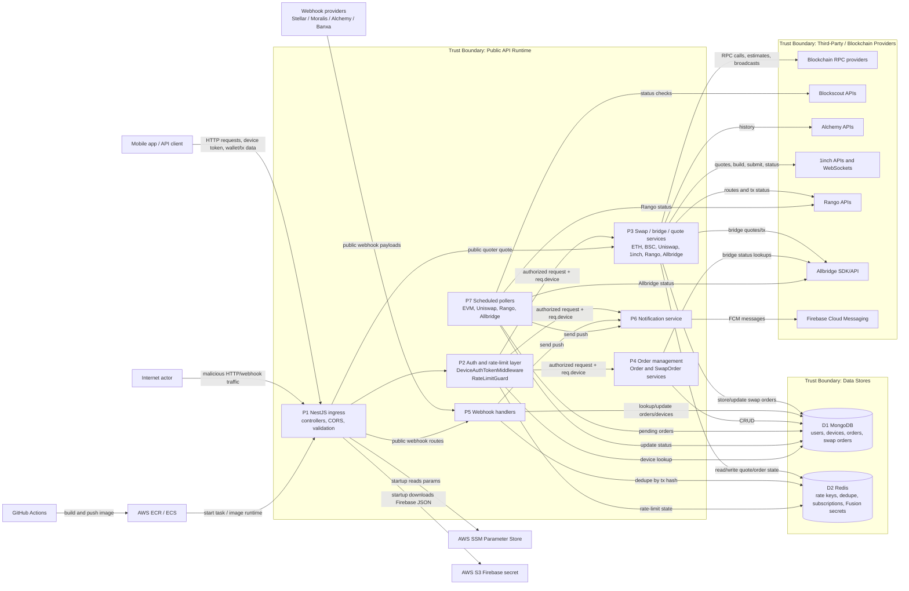

# Level-1 Data Flow Diagram

## Diagram

## Data Flows

| ID | Flow | Data | Trust boundary crossed | Notes |
|---|---|---|---|---|
| F1 | Client to API | Device token, wallet address, token identifiers, signed txs, quote/order DTOs | TB1 | Primary public API boundary. |
| F2 | Public webhook provider to API | Provider event payloads, status values, encrypted tags, order numbers | TB2 | Public and unauthenticated in code. |
| F3 | API auth layer to MongoDB | Device lookup by `_id` from token | TB3 | `_id` is trusted after JWT decode; signature verification is missing. |
| F4 | API auth layer to Redis | Rate-limit counters keyed by request IP | TB4 | Redis availability affects request acceptance. |
| F5 | Swap services to blockchain RPC | `eth_call`, gas estimate, nonce, balance, signed transaction broadcast | TB5 | Signed transactions can move funds once broadcast. |
| F6 | Swap services to 1inch | API key, quote/build/order/secret/status requests, WebSocket events | TB6 | Fusion/Fusion+ settlement depends on provider responses and secret handling. |
| F7 | Swap services to Rango | API key, route requests, confirmation, tx creation, status checks | TB6 | Used for cross-chain route and status data. |
| F8 | Bridge services to Allbridge | Chain/token lookup, allowance check, raw tx building, bridge status | TB6 | Used for bridge transaction construction and completion status. |
| F9 | Transaction history to Alchemy | API key, wallet address, chain, page keys | TB6 | Returns wallet transaction history and token metadata. |
| F10 | Pollers to Blockscout/Rango/Allbridge | Pending tx hashes and chain identifiers | TB6/TB10 | Updates MongoDB and pushes notifications based on third-party statuses. |
| F11 | Webhooks/orders to Firebase | FCM token, title/body/data payload | TB7 | User-visible messages; false positives can mislead users. |
| F12 | Runtime startup to AWS SSM | SSM parameter names and decrypted values | TB8 | Current script writes values to `/app/.env` and logs them. |
| F13 | Runtime startup to AWS S3 | Firebase service account JSON | TB8 | Hardcoded dev bucket path; credential becomes local file. |
| F14 | GitHub Actions to AWS | Docker image, ECS update command, OIDC role | TB9 | CI/CD compromise can deploy malicious service code. |
| F15 | API to MongoDB | User, device, order, swap-order persistence | TB3 | Contains personal data, wallet data, FCM tokens, and order state. |
| F16 | API to Redis | Dedupe keys, active subscriptions, Fusion secrets | TB4 | Secret material can be long-lived if no TTL is provided. |
| F17 | Logs to operator/log sink | Payloads, device data, decoded token, startup env values, provider errors | TB12 | Must be treated as sensitive data flow. |

## Level-1 Process Descriptions

| Process | Responsibilities | Main inputs | Main outputs |
|---|---|---|---|
| P1 NestJS ingress | Route dispatch, CORS, global validation transform, BigInt serialization | HTTP requests and webhook requests | Controller method calls, responses |
| P2 Auth and rate-limit layer | Device token check, `req.device` enrichment, per-IP rate limiting | Headers, source IP | Authorized request context, rate-limit errors |
| P3 Swap/bridge/quote services | Build quotes, prepare unsigned txs, broadcast signed txs, submit/cancel/status swap orders | Wallet/token/amount DTOs, signed txs, provider API keys | Quote data, raw txs, provider order data, broadcasts |
| P4 Order management | Store and retrieve swap/order state; update order status | Device object, order DTOs, tx hashes, wallet addresses | MongoDB order records, status updates |
| P5 Webhook handlers | Process provider callbacks and send notifications | Public webhook payloads | Order updates and notification requests |
| P6 Notification service | Send Firebase notifications | FCM token and notification payload | FCM message ID/status |
| P7 Scheduled pollers | Reconcile pending order status with third-party sources | Pending swap orders | MongoDB status updates and notifications |

## Boundary-Specific Assumptions

- TLS termination is assumed to exist before the NestJS service, but TLS configuration was not present in this repository.
- Real AWS IAM permissions, ECS task role scope, VPC routing, MongoDB TLS/auth settings, Redis TLS/auth settings, WAF/API gateway settings, and log retention policies were not visible in the codebase.
- The service does not appear to custody private wallet keys, but it receives signed transactions and constructs unsigned transactions that users may sign.
- Provider API base URLs are environment-controlled, not directly user-provided. If SSM or environment variables are compromised, provider calls can become an SSRF/API-key-exfiltration path.

